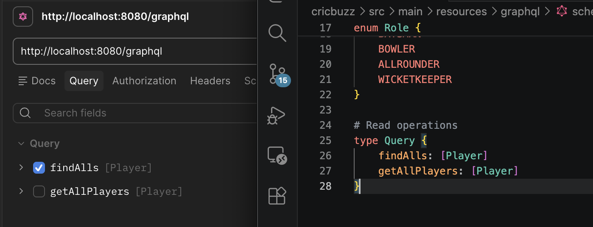
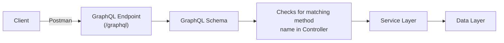
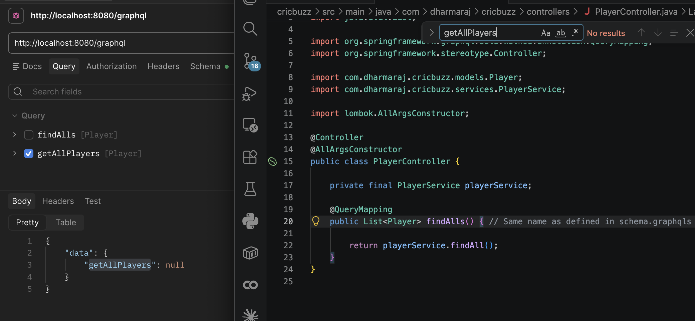
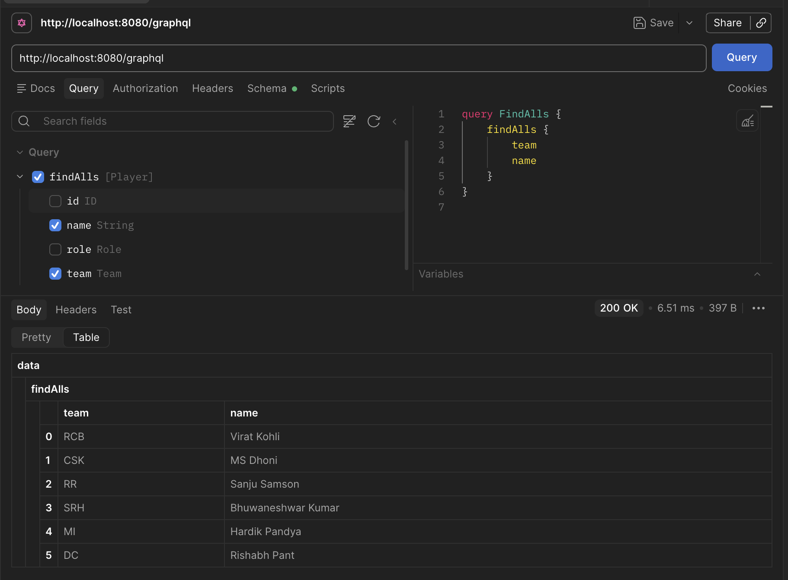
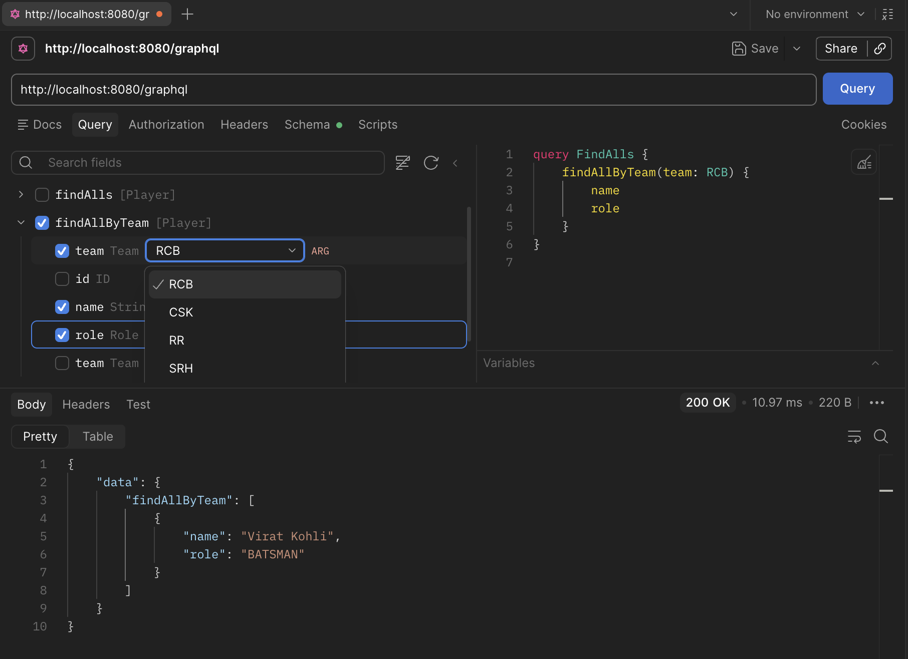
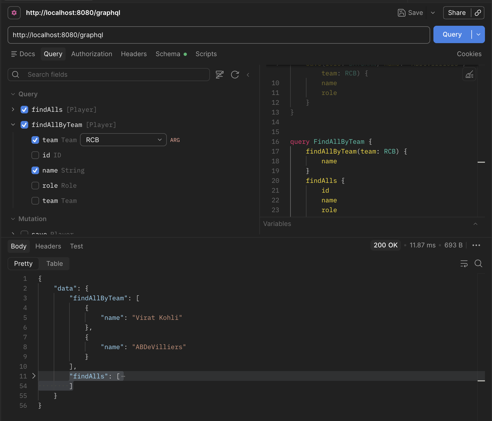

# Understanding GraphQL: Setting It Up in Spring Boot

Till now, we've talked about why GraphQL exists — a single flexible endpoint instead of many fixed-shape REST endpoints. Now let's see how this actually gets wired up in a real Spring Boot application.

We'll work through this using CRUD operations in the [cricbuzz](../cricbuzz/) Spring Boot application.

Dependency to add in your `pom.xml`:

```xml
<dependency>
    <groupId>org.springframework.boot</groupId>
    <artifactId>spring-boot-starter-graphql</artifactId>
</dependency>
```

## Defining the schema

The first thing you need is a schema file. Create a [schema.graphqls](../cricbuzz/src/main/resources/graphql/schema.graphqls) file inside your `resources` folder, and define your queries and mutations there. This schema is essentially the contract for what your GraphQL API can do — and whatever you define here, you'll be able to see reflected in Postman.



Here's what happens when a request comes in:



Now here's a question worth pausing on: what do you think happens if you define a query in your schema file, but never actually implement it in the controller?

It doesn't throw an error. It just quietly returns `null`.



This is actually one of the neat things about GraphQL — it only resolves what you've wired up, and nothing breaks loudly if a field is missing. It just tells you, "I don't have this."

## Calling a query and understanding the naming rules

Let's call the `findAlls` query from Postman and look at the response.



Here's something worth noticing carefully:

- The query name in the schema is `findAlls`.
- The method name in the **controller** is also `findAlls`.
- The method name in the **service layer** is `findAll`.

Did you catch the pattern? The controller method name has to match the query name defined in the schema — that's how GraphQL knows which method to call. But the service layer method can be named anything you like, because the controller is the one responsible for calling it. The schema only cares about the controller.

So the rule of thumb is:

- Schema query name ↔ Controller method name → **must match**
- Controller method → Service layer method → **can be anything**

## One endpoint, many queries

Here's where GraphQL really shows its strength. Every query and mutation you define goes through the same single endpoint, `/graphql`.



And because it's just one endpoint accepting a structured request body, you can actually send **multiple queries in a single request**. Try doing that in REST — you'd need separate calls for separate resources. GraphQL lets you batch them together and get everything back in one response.



## How GraphQL annotations map to REST

If you're coming from a REST background, you'll notice GraphQL's annotations feel pretty familiar — they're just doing the same job with different names:

| REST | GraphQL |
|------|---------|
| `@GetMapping` | `@QueryMapping` |
| `@PostMapping`, `@PutMapping`, `@DeleteMapping` | `@MutationMapping` |
| `@RequestParam`, `@RequestBody`, `@PathVariable` | `@Argument` |

So if you already know Spring MVC, you're not learning a completely new mental model here — just a new set of annotations for the same underlying ideas.

## Summary

Okay, let's quickly recap what we covered:

1. Queries and mutations are defined in a `schema.graphqls` file.
2. A schema field with no matching controller method silently returns `null` instead of erroring.
3. The controller method name must match the schema's query/mutation name; the service layer method name doesn't matter.
4. Every query and mutation goes through the same `/graphql` endpoint.
5. Multiple queries can be batched into a single request — something REST can't do natively.
6. `@QueryMapping`, `@MutationMapping`, and `@Argument` map neatly to their REST counterparts.

## Next Steps

Now that you understand how queries flow through the schema and controller, the next step is writing data instead of just reading it — let's see how mutations work in practice.

That's what we'll explore next.

---

[**Previous**: <- Why GraphQL](./1-why-graphql.md) | [Writing Data with Mutations -> **Next**](./3-writing-data-with-mutations.md)
