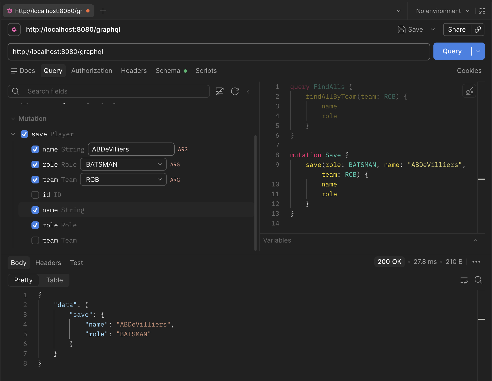

# Understanding GraphQL: Writing Data with Mutations

Earlier, we saw how queries flow from Postman through the schema into the controller, and how a single `/graphql` endpoint can handle multiple queries at once. So far we've only been reading data with those queries. Now let's write some.

## Saving data with a mutation

To save a player, you'd create a method annotated with `@MutationMapping` in the controller and define the corresponding mutation in your schema file.

Notice something interesting here — even for a *write* operation, you still get to choose which fields come back in the response. That's the same flexibility queries give you, just applied to mutations.

## Update and delete follow the same pattern

`Update` and `Delete` work exactly the same way as `Save`. For any of these operations, you just need to:

1. Define the mutation in the schema file.
2. Create a method in the controller, annotated with `@MutationMapping`.
3. Call the appropriate service layer method to actually perform the operation.

That's really it — once you've internalized this three-step pattern, every mutation you write from here on follows the same shape.

## Summary

Okay, let's quickly recap what we covered across this series:

1. GraphQL replaces multiple fixed-shape REST endpoints with a single flexible endpoint.
2. Clients decide exactly which fields they want — no over-fetching, no under-fetching.
3. `Query` handles reads, `Mutation` handles writes.
4. The controller method name must match the schema's query/mutation name; the service layer method name doesn't matter.
5. Writing data with `@MutationMapping` follows the same three-step pattern every time: schema, controller, service.

## Next Steps

Now that you understand how GraphQL handles reads and writes through a single endpoint, the natural next question is: how do you handle relationships between types — like fetching a product along with its nested orders and user data — without running into performance problems like the N+1 query issue?

That's what we'll explore next.

---

[**Previous**: <- Setting Up GraphQL in Spring Boot](./2-setting-up-graphql-spring-boot.md)
